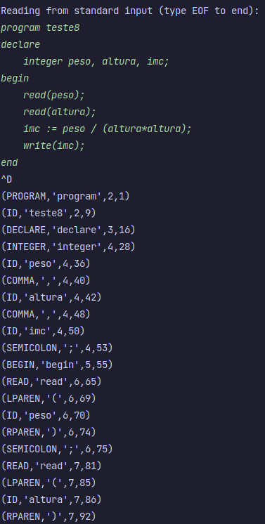

# Lexical Analyzer with PLY

This project is a lexical analyzer built with Python using the PLY library. It features custom tokens, processing rules, and a symbol table to store recognized tokens.

## Requirements

- Python 3.x
- PLY
- pytest (for running tests)

## Installation

Follow the steps below to set up and run the project.

### 1. Create a Virtual Environment

```shell
python -m venv venv
```

### 2. Activate the Virtual Environment

On Linux:

```shell
source venv/bin/activate
```

On Windows:

```shell
.\venv\Scripts\activate
```

### 3. Install the Dependencies

```shell
pip install -r requirements.txt
```

## Usage

### Running the Lexical Analyzer

1. Run the `main.py` file:

```shell
python main.py
```

2. Insert or paste the code you wish to analyze.
3. Press `CTRL + D` (on Linux) to finish the input.
4. The output will be displayed on the screen, as shown in Figure 1 below.



### Running Unit Tests

Ensure all dependencies are installed and run:

```shell
pytest
```

All unit tests should pass, validating the functionality of the lexical analyzer.

## Simbols Table

The Symbols Table stores recognized tokens, their types, and positions in the source code. Below is an example displaying various tokens and their details.

```json
{
  "teste8": {
    "Position": {
      "line": 1,
      "pos": 8
    },
    "Type": "ID"
  },
  "peso": {
    "Position": {
      "line": 3,
      "pos": 35
    },
    "Type": "ID"
  },
  "altura": {
    "Position": {
      "line": 3,
      "pos": 41
    },
    "Type": "ID"
  },
  "imc": {
    "Position": {
      "line": 3,
      "pos": 49
    },
    "Type": "ID"
  }
}
```
